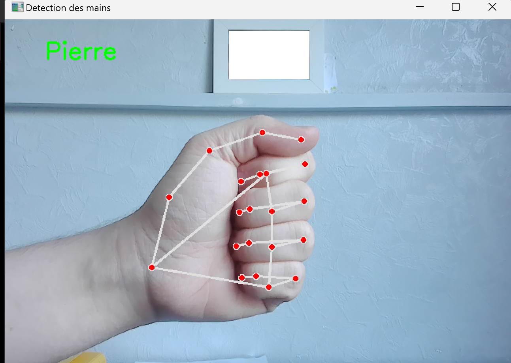
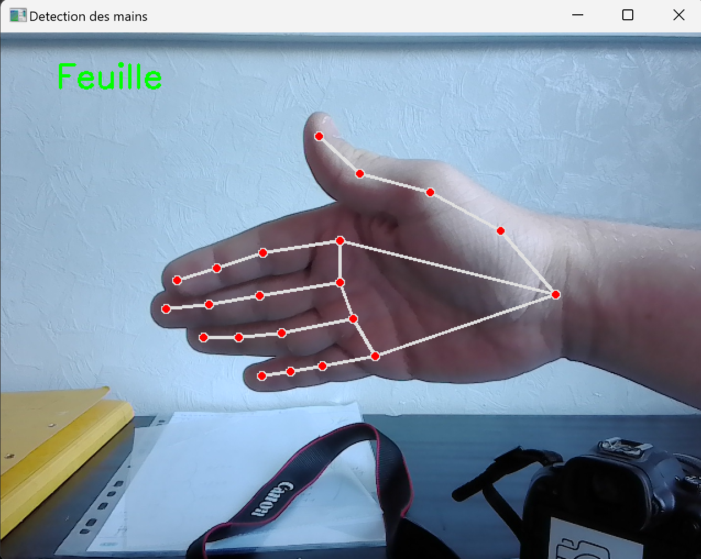
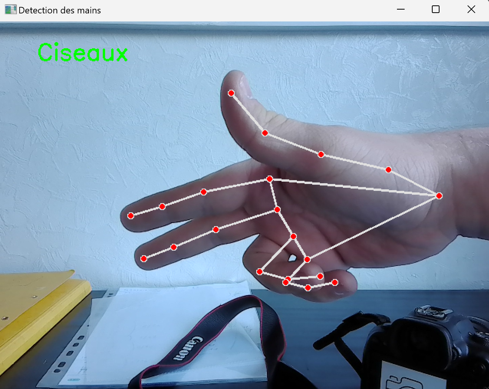

# ✊🖐✌️ Détection Pierre - Feuille - Ciseaux avec la Caméra

Ce mini-projet de *computer vision* et *machine learning* a été réalisé dans un but pédagogique : apprendre les bases de la détection d’objets et de la classification via caméra. Il permet de détecter en temps réel si l’utilisateur fait le geste **Pierre**, **Feuille** ou **Ciseaux**, simplement avec sa webcam.

L'objectif de ce projet est d'être une introduction à un future projet de décodage de la langue des signes.

---

## 🎯 Objectifs

- Apprendre les bases de la vision par ordinateur
- Implémenter un modèle simple
- Utiliser la webcam comme source vidéo en temps réel
- S’amuser en jouant à Pierre-Feuille-Ciseaux avec une IA 🤖

---

## 📷 Aperçu

<p align="center">
  
</p>

<p align="center">
  
</p>

<p align="center">
  
</p>
  
---

## 🧠 Fonctionnalités

- 🎥 Capture vidéo en direct via la webcam
- 🤖 Détection du geste effectué : pierre, feuille ou ciseaux
- 📊 Modèle de machine learning
- 🕹️ Interface simple avec retour en temps réel du geste reconnu

---

## 🧰 Prérequis

- Python 3.7 ou supérieur
- Bibliothèques nécessaires :
  - `opencv-python`
  - `tensorflow` ou `scikit-learn` (selon le modèle utilisé)
  - `numpy`

### Installation des dépendances

```bash
pip install opencv-python numpy tensorflow
